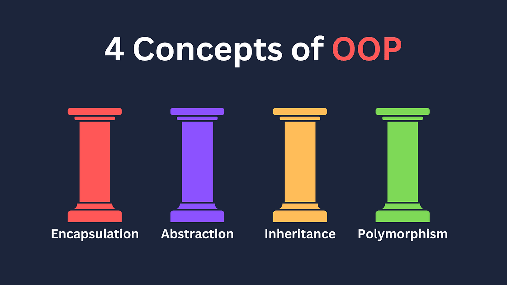

# OOP là gì?

- OOP (Object-Oriented Programming - Lập trình hướng đối tượng) là một phương pháp lập trình tổ chức chương trình dựa trên các đối tượng (objects).

- Mỗi đối tượng đại diện cho một thực thể , chứa
  - Thuộc tính (attributes): Đại diện cho trạng thái hoặc dữ liệu đối tượng
  - Phương thức (methods): Đại diện cho hành vi hoặc các thao tác mà đối tượng có thể thực hiện.

# 4 nguyên lý cơ bản của OOP:

1. Encapsulation (Đóng gói):

- Thuộc tính (attributes) và phương thức (methods) được gói gọn trong một lớp (class).
- Kiểm soát quyền truy cập dữ liệu thông qua các access modifiers như public và private

```js
VD: class Person {
 private String name;

    public String getName() {
        return name;
    }

    public void setName(String name) {
        this.name = name;
    }

}
```

2. Inheritance (Kế thừa):

- class này có thể kế thừa thuộc tính (attributes) và phương thức (methods) từ một class khác ( class cha)

```js
class Animal {
    void eat() {
        System.out.println("Eating...");
    }
}

class Dog extends Animal {
    void bark() {
        System.out.println("Barking...");
    }
}
```

3. Polymorphism (Đa hình):

- Cho phép các đối tượng cùng kế thừa một lớp cha có thể hành xử khác nhau khi sử dụng chung một phương thức (methods).

- Gồm hai loại:
  - Compile-time Polymorphism: Overloading (nạp chồng phương thức (methods)).
  - xảy ra khi nhiều phương thức (methods) có cùng tên nhưng khác nhau về số lượng tham số hoặc kiểu dữ liệu của tham số trong cùng một lớp Quyết định sử dụng phương thức (methods) nào sẽ được thực hiện tại thời điểm biên dịch

```js
class Calculator {
    // Nạp chồng phương thức "add"
    int add(int a, int b) {
        return a + b; // Cộng 2 số nguyên
    }

    double add(double a, double b) {
        return a + b; // Cộng 2 số thực
    }

    int add(int a, int b, int c) {
        return a + b + c; // Cộng 3 số nguyên
    }
}
```

- Run-time Polymorphism: Overriding (ghi đè phương thức (methods)).
  - xảy ra khi một lớp con định nghĩa lại một phương thức(methods) của lớp cha. (khi lớp con thay thế hành vi của lớp cha, làm cho cùng một phương thức (methods) nhưng hành xử khác nhau.)

```js
class Animal {
    // Phương thức chung cho động vật
    void sound() {
        System.out.println("Animal makes a sound");
    }
}

class Dog extends Animal {
    // Ghi đè phương thức sound của lớp cha
    @Override
    void sound() {
        System.out.println("Dog barks");
    }
}
```

4. Abstraction (Trừu tượng hóa):

- Chỉ tập trung vào các đặc điểm quan trọng của đối tượng, ẩn đi các chi tiết không cần thiết.
- Thực hiện thông qua lớp trừu tượng (abstract class) hoặc giao diện (interface).

Mục tiêu của Trừu tượng hóa

```js
Giảm độ phức tạp:
    Chỉ cung cấp những chi tiết cần thiết, giúp người dùng tập trung vào mục tiêu chính mà không bị rối bởi chi tiết thực thi.

Dễ bảo trì và mở rộng:
    Che giấu phần cài đặt giúp dễ dàng thay đổi hoặc cập nhật logic bên trong mà không ảnh hưởng đến phần bên ngoài.


Ví dụ thực tế
Hãy nghĩ đến một chiếc xe hơi:

Những gì bạn cần biết (Abstraction):
Xe có thể bật máy, tăng tốc, hoặc phanh.
Những gì bạn không cần biết:
Cách động cơ hoạt động, cách xăng được đốt cháy, cách hệ thống phanh được triển khai.
```

# Tại sao phải dùng nó

- Tái sử dụng mã nguồn (Reuse):
  Thông qua kế thừa, bạn có thể sử dụng lại mã của lớp cha mà không cần viết lại.

- Dễ bảo trì và mở rộng:
  Cấu trúc rõ ràng giúp dễ dàng thêm tính năng mới hoặc sửa đổi mà không ảnh hưởng đến toàn bộ chương trình.

- Quản lý phức tạp:
  OOP mô phỏng các thực thể trong thế giới thực, giúp bạn dễ hình dung và quản lý các hệ thống lớn.

- Tăng tính bảo mật:
  Encapsulation (Đóng gói) giúp kiểm soát dữ liệu và ngăn chặn truy cập trái phép.

- Tính linh hoạt (Polymorphism):
  Các đối tượng có thể thay thế cho nhau khi cần, giúp mã dễ mở rộng và bảo trì.
