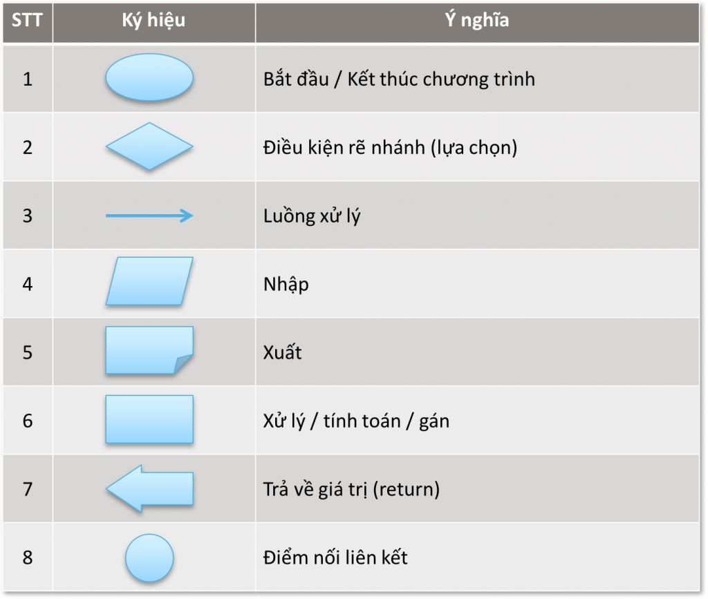
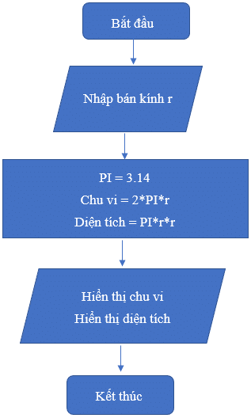

# Lưu đồ thuật toán là gì?

- là một dạng biểu đồ sử dụng các ký hiệu hình học để mô tả thuật toán, theo dõi luồng logic từ input -> output .

# Tại sao phải dùng ?

- Trực quan hóa:
  Hiển thị rõ ràng luồng logic của thuật toán.

- Dễ hiểu:
  Nắm bắt quy trình nhanh hơn.

- Phân tích và sửa lỗi:
  Dễ dàng phát hiện sai sót trong quy trình hoặc logic.

- Hỗ trợ làm việc nhóm:
  Có cách nhìn tổng quan cho các thành viên và chúng ta thiết kế thuật toán.

# 1 số thành phần chính

# ví dụ:

# Dùng lưu đồ khi:

- Khi cần trình bày thuật toán cho nhóm hoặc người không chuyên về lập trình.

- Khi cần phân tích quy trình hoặc thiết kế tài liệu dự án.

- Khi cần tìm hiểu các vấn đề liên quan đến luồng điều kiện hoặc phân nhánh.

# Lưu ý khi viết lưu đồ :
- Cần viết đúng trọng tâm
- Hạn chế viết dài dòng
- Túm váy là : ngắn - gọn - dễ hiểu
