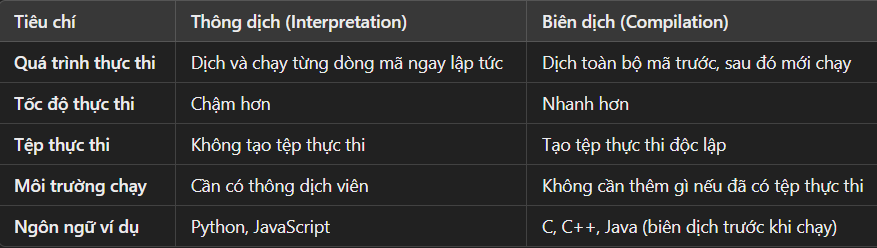

# Chương trình (program)

- là dãy các chỉ thị (instruction) điều khiển hoạt động của PC -> giải quyết 1 vấn đề nào đó.

- Người viết chương trình (programmer) là người viết những chương trình đó.

**1. Chương trình mã máy (machine code program)**

- Mã máy (machine code): là các lệnh tồn tại ở dạng các bit 0, 1
- Sau đó các bit này sẽ nạp vào RAM (nạp khi use ra lệnh thực thi (click))
- CPU sẽ đọc và thực thi bit được lưu trong RAM

> **_NOTE:_** Dev sẽ không viết phần mềm bằng cách viết trực tiếp chương trình mã máy (machine code program), bởi vì:
>
> - quá khó (nó sinh ra để nạp vào RAM và CPU thực thi nó)
> - tốn thời gian và công sức
> - khả năng giới hạn (không thể đem bán vì khách hàng có thể dùng hệ điều hành khác hay máy tính khác)
>
> **=> Để khắc phục vấn đề này -> người ta đã sinh ra khái niệm "chương trình hợp ngữ và hợp dịch"**

**2. Chương trình hợp ngữ và trình hợp dịch**

**2.1 Hợp ngữ**

- là loại ngôn ngữ lập trình trừu tượng hơn so với ngôn ngữ máy (ở mục 1)

> **_NOTE:_** Hiểu nôm na đơn giản là ngôn ngữ máy rất khó lập trình , nên người ra sinh ra hợp ngữ

**2.2 Hợp dịch**

- do CPU máy không thể hiểu 1 chương trình hợp ngữ, nên khi 1 chương trình hợp ngữ được thực hiện thì phải dịch thành ngôn ngữ máy,
  nên được gọi là hợp dịch.

> **_NOTE:_** Hợp ngữ -> hợp dịch -> mã máy (bit 0,1)

**3 Ngôn ngữ lập trình ('Hợp ngữ' -> lập trình)**

- là ngôn ngữ được lập trình viên dùng để viết chương trình.

**3.1 Ngôn ngữ lập trình cấp thấp (low-level programming language)**

- phụ thuộc vào từng họ, dòng , hệ điều hành máy cụ thể ( nghĩa là đoạn code không chạy được trên máy khác khi khác hệ điều hành),

- Nhược điểm:
- chỉ chạy từ trên xuống ( có nghĩa có 100 dòng -> chạy từ dòng 1 -> dòng 100 ( cấp cao thì có thể chạy dòng 10 -> đến dòng 20 -> về dòng 5))
- phải phụ thuộc vào máy móc. Mức trừu tượng hóa thấp (gần với phần cứng),
- không có khái niệm promise , async await, ....

**3.2 Ngôn ngữ cấp cao(hight-level - cũng là ngôn ngữ hiện tại)**

- khắc phục vấn đề, nhược điểm của ngôn ngữ cấp thấp.

- cách hoạt động để chạy được ngôn ngữ cấp cao là cần có "máy ảo hỗ trợ thi hành mã trừu tượng", máy ảo ở đây là "môi trường phát triển", ví dù code java thì phải cài NetBeans, code mobile phải cài máy ảo chạy java (android) và swift (IOS). Vì vậy ngôn ngữ cấp cao không phụ thuộc vào từng họ máy nữa . Chỉ cần có môi trường thích hợp là có để dịch và chạy được mã nguồn.

**4 Các chương trình dịch ("hợp dịch" -> các chương trình dịch)**

**4.1 Thông dịch (Interpretation)**

- Quá trình chuyển đổi mã nguồn (source code) sang mã máy (machine code) và thực thi trực tiếp từng dòng lệnh mà không cần tạo ra tệp thực thi độc lập.

- Ưu điểm:

  - Dễ dàng kiểm tra, sửa lỗi vì có thể thực thi mã ngay lập tức.
  - Phù hợp cho việc phát triển và thử nghiệm nhanh (e.g., Python, JavaScript).

- Nhược điểm: - Tốc độ chậm hơn do phải dịch mã từng dòng khi chạy. - Phụ thuộc vào thông dịch viên, không thể chạy độc lập nếu không có môi trường.

**4.2 Biên dịch (Compilation)**

- Quá trình dịch toàn bộ mã nguồn sang mã máy trước khi chạy, tạo ra một tệp thực thi độc lập.

- Ưu điểm:

  - Hiệu năng tốt hơn, tốc độ thực thi nhanh hơn.
  - Tệp thực thi có thể chạy độc lập, không cần cài đặt thêm.

- Nhược điểm:

  - Quá trình biên dịch mất thời gian hơn.
  - Việc sửa lỗi khó khăn hơn vì cần biên dịch lại mỗi khi sửa mã.

    
