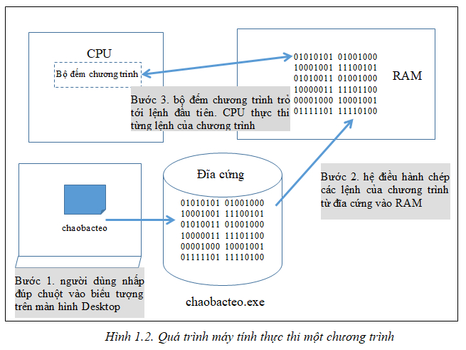

# Chương trình (program)

- là dãy các chỉ thị (instruction) điều khiển hoạt động của PC -> giải quyết 1 vấn đề nào đó.

- Người viết chương trình (programmer) là người viết những chương trình đó.

**1. Chương trình mã máy (machine code program)**

- Mã máy (machine code): là các lệnh tồn tại ở dạng các bit 0, 1
- Sau đó các bit này sẽ nạp vào RAM (nạp khi use ra lệnh thực thi (click))
- CPU sẽ đọc và thực thi bit được lưu trong RAM

> **_NOTE:_** Dev sẽ không viết phần mềm bằng cách viết trực tiếp chương trình mã máy (machine code program), bởi vì:
>
> - quá khó (nó sinh ra để nạp vào RAM và CPU thực thi nó)
> - tốn thời gian và công sức
> - khả năng giới hạn (không thể đem bán vì khách hàng có thể dùng hệ điều hành khác hay máy tính khác)
>
> **=> Để khắc phục vấn đề này -> người ta đã sinh ra khái niệm "chương trình hợp ngữ và hợp dịch"**

**2. Chương trình hợp ngữ và trình hợp dịch**
