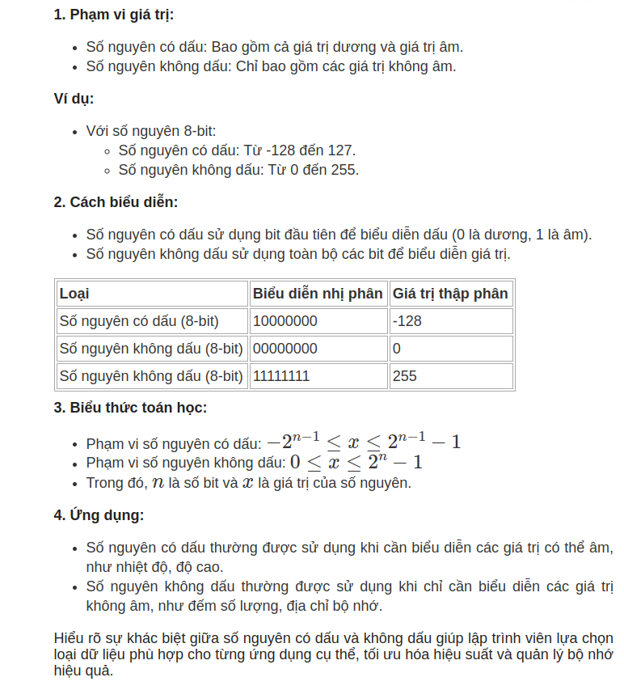
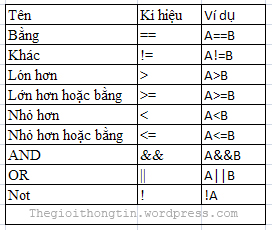

# Chương trình đơn giản

**1. Quy ước đặt tên**

- Các biến - hằng (const) - đối tương đặt tên theo quy chuẩn sau
  - aA -> zZ
  - 0 -> 9
  - dùng dấu "\_"

> **_NOTE:_**
>
> - Tên phải bắt đầu từ chữ cái
> - Để dễ hiểu và dễ nhớ , tên thường đặt theo 1 quy chuẩn và gợi nhớ ( có liên quan đến ngữ nghĩa của đối tượng)

**2. Khái niệm về nhập , xuất , tính toán**

- Nhận dữ liệu từ người dùng ( click chuột , bàn phím , thao tác nào đó để gửi tín hiệu cho máy tính) -> gọi là nhập dữ liệu

- Trả ra kết quả từ thao tác của người dùng -> xuất dữ liệu

- Tính toán hay xử lý dữ liệu nhập 1 cách thích hợp để ra được kết quả -> gọi là tính toán dữ liệu

```js
class Calculator {
    int add(int a, int b) {

      let current = 0;
      current = a + b;

      return current;
    }
}
```

**3. Các kiểu dữ liệu và phép toán**

**3.1 Kiểu số nguyên**


https://rdsic.edu.vn/blog/toan/giai-ma-so-nguyen-khong-dau-nhung-bi-mat-quanh-so-hoc-nguyen-to-vi-cb.html

- Kiểu Char:

  - Phạm vi lưu trữ: 1-byte (8-bit)
  - khoảng từ -127 -> 127 ký tự

- Kiểu Unsigned Char:

  - Phạm vi lưu trữ: 1-byte (8-bit)
  - khoảng từ 0 -> 256 ký tự

- Kiểu Int / Unsigned Int:

  - Phạm vi: 16 bit - 32 bit

- Kiểu Short / Unsigned Short

  - Phạm vi: 16 bit

- Kiểu Long / Unsigned Long:
  - Phạm vi: 32 bit

**3.2 Kiểu số thực**

- Kiểu float:

  - Phạm vi: Lưu trữ 32 bit

- Kiểu double:
  - Phạm vi: Lưu trữ 61 bit

> **_NOTE:_**: Kiểu số thực sẽ cho kết quả tính toán ( đối với toán học) có độ
> chính xác hơn. Giả dụ ta có A = 3 , B = 4, ta có hàm tính toán là A/B (3/4),
> đối với số nguyên thì kết quả sẽ là 0
> đối với số thực thì kết quả sẽ là 0.75
> Ngoài ra , số thực còn có thể tính toán các hàm toán học như: căn số , lũy
> thừa , logaric và các hàm lượng giác.

**3.3 Kiểu luận lý**

- Là kiểu nguyên đặc biệt, sẽ cho ra 1 biểu thức != 0 => true, == 0 -> false.



**3.4 Kiểu ký tự**

- Là một kiểu dữ liệu có độ lớn 1 byte (8 bits) dùng để lưu trữ 1 kí tự trong vùng nhớ máy tính.

- Kí tự có thể là các chữ cái đơn trong bảng chữ cái (a, b, c, ... x, y z), có thể là các kí hiệu toán học (+, -, \*, /, ...), hay có thể là những con số (0, 1, 2, ..., 9)...

**Kiểu 8 bit**

- \*/ Dựa trên bảng mã ASCII (American Standard Code for Information Interchange - Chuẩn mã trao đổi thông tin Hoa Kỳ)

  - Là bảng mã ký tự 8-bit, hỗ trợ 128 ký tự đầu tiên, bao gồm:
    - Ký tự in được: A-Z, a-z, 0-9, dấu câu.
    - Ký tự điều khiển: Như Tab, Enter, Backspace, v.v.

- Sau này , ASCII được mở rộng để thêm các ngôn ngữ khác ngoài tiếng anh (gồm 256 ký tự), đó là ISO-8859-x

- \*/ Bảng mã mở rộng 8-bit(ISO-8859-x):
  x ở đây sẽ chia theo từng vùng (VD: x = 1 -> vùng ngôn ngữ Tây Âu(Pháp, Đức, Tây Ban Nha), x = 2 -> Đông Âu (Ba Lan, Séc))

- Bảng mã phức tạp hơn:
  Đối với các ngôn ngữ có nhiều ký tự thì 8-bit không thể chứa đủ, ví dụ: Shift-JIS (tiếng Nhật) , Big5 (tiếng Trung).

**Kiểu ký tự Unicode**

- Unicode ra đời để khắc phục các vấn đề của kiểu 8 bit bên trên, cách khắc phục:
  - Tạo ra 1 bảng mã duy nhất (code point) cho mọi ngôn ngữ.
  - Mỗi ký tự được gán một mã duy nhất (code point), ví dụ:
    "A" → U+0041 (tiếng Anh).
    "你" → U+4F60 (tiếng Trung).
    "日" → U+65E5 (tiếng Nhật).

Và để gắn mỗi code point , người ta cần mã hóa chúng , vậy nên đã tạo ra UTF:

- UTF-8 (8-bit): Tối ưu cho văn bản ASCII và phổ biến trên web.
- UTF-16 (16-bit): Tối ưu cho các ngôn ngữ châu Á và ký tự phức tạp.
- UTF-32 (32-bit): Đơn giản nhưng tốn kém về mặt bộ nhớ.

> Note: Lúc đầu chỉ có UTF-8 và UTF-16 bit, nhưng do phải phân tích và giải mã ký
> tự Unicode (do có ký tự 8 bit, ký tự 16 bit nên việc giải mã tốn time), nên
> người ra tạo ra UTF-32 ( mặc định mỗi ký tự sẽ là 32 bit), nhưng vấn đề phải
> đánh đổi là tốn kém về mặt bộ nhớ.

**3.5 Kiểu chuỗi ký tự**

- Là 1 chuỗi ký tự sẽ được đặt trong dấu nháy kép ("Chương trình máy tính").

Lưu ý: khi tạo 1 hằng trong chương trình và khai báo kiểu ký tự UTF-16, nhưng trên hệ điều hành máy đó không cài đầy đủ ngôn ngữ cho tiếng nào đó cần in thì chương trình khi in ra sẽ bị lỗi ,
VD: "Chương trình máy tính" -> khi in ra mà hệ điều hành không cài ngôn ngữ tiếng việt thì nó sẽ như này -> "Ch??ng tr?nh m?y t?nh".

**3.6 Phép gán và lệnh phép gán**

- trong chương trình tính toán phép toán, thì ngôn ngữ lập trình C/C++ cho phép người dùng viết các lệnh gán như:
  SUM++ thay cho SUM = SUM + 1
  SUM +=2 thay cho SUM = SUM + 2
  SUM +=n thay cho SUM = SUM + n

- Ngoài ra , còn có lệnh cô đọng như:
  n = ++m (nghĩa là m + 1 -> n = m)
  n = m++ (nghĩa là n = m, sau đó m + 1)

**3.7 Vấn đề tràn số**

- Trước khi nói đến vấn đề tràn số , thì ta nói đến lưu trữ máy tính.

Lưu trữ trên máy tính luôn có giới hạn về vĩ mô, vi mô, và mỗi kiểu dữ liệu sẽ có 1 phạm vi , VD: Số nguyên sẽ có số nguyên nhỏ nhất, số nguyên lớn nhất, số thực sẽ có trị tuyệt đối nhỏ nhất và trị tuyệt đối lớn nhất.
Vậy nguyên nhân gây lên vấn đề tràn số là kết quả của phép tính cho ra kết quả cực lớn hoặc cực nhỏ.

```js
//Ví dụ 1: Tràn số nguyên
#include <stdio.h>

int main() {
    char a = 127;  // Kiểu char 8-bit (giới hạn -128 đến 127)
    a = a + 1;     // Vượt quá giới hạn
    printf("Kết quả: %d\n", a); // kết quả là -128 (tràn số, vòng lại giá trị nhỏ nhất)
    return 0;
}
```

```js
//Ví dụ 1: Tràn số thực
#include <stdio.h>

int main() {
    float large = 1e38;  // Giá trị rất lớn
    large = large * 100.0f;  // Nhân thêm để gây tràn số
    printf("Kết quả: %f\n", large); // kết quả inf (vô hạn)
    return 0;
}
```

Để giải quyết vấn đề tràn số thì người lập trình phải ước lượng để kết quả , ước tính đầu vào - ra , validate , và chọn kiểu dữ liệu thích hợp.
