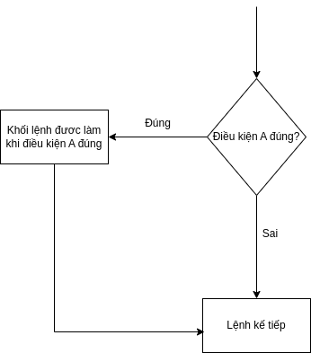
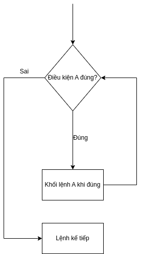
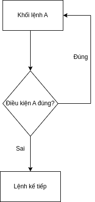
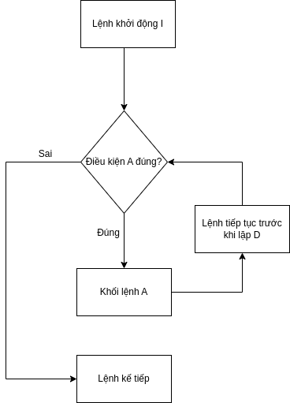

# Khối lệnh (block)

- là tập hợp các đoạn mã nằm trong dấu ngoặc nhọn "bắt đầu bởi {, kết thúc bởi }"

```js
function main() {
  //Khối lệnh cha
  const a = 2;
  const b = 5;

  if (b > a) {
    //Khối lệnh con
    const c = b + a;
    console.log(c);
  }
}
```

**1. Biến (Variable)**

- Là một vùng nhớ dùng để lưu trữ dữ liệu,
- Nó có thể thay đổi giá trị (value) trong suốt quá trình chạy chương trình

```c
int a=1, y=0;
```

**1.1 Phạm vi sử dụng của biến**

- Biến có thể khai báo 1 cách cục bộ bên trong mỗi khối lệnh và không thể sử dụng bên ngoài khối lệnh đó.

```js
function main() {
  const a = 2;
  console.log(a); // Sử dụng bên trong khối lệnh
}

console.log(a); // Không thể gọi "a" ở đây
```

- Lưu ý:
  - 2 biến chung 1 khối không thể trùng tên
  - Biến trong khối A có thể hiểu các khối nằm bên trong A
  - Trường hợp trùng tên biến giữa khối cha và khối con thì mặc định sẽ hiểu biến được bọc gần nhất

```js
function main() {
  const a = 2;
  const a = 3; // Lỗi , không thể trùng tên

  if (a > 0) {
    console.log(a); //a = 2, Khối con có thể hiểu được biến từ khối cha

    const a = 7;
    console.log(a); // a = 7, mặc định lấy biến gần nhất nếu trùng tên với biến ở khối cha
  }
}
```

**1.2 Biến toàn cục**

- Là biến nằm bên ngoài tất cả các khối lệnh

```js
const ABC = 2; // biến toàn cục
function main() {
  // logic khối
}
```

- tác dụng của biến toàn cục:
  - Nó cỏ thể được truy xuất mọi nơi trong chương trình( Ngoại trừ trùng tên).

# Cấu trúc rẽ nhánh

**1. Cấu trúc rẽ nhánh if else**


```js
if (A === true) {
  //Khối lệnh A
}

// Lệnh kế tiếp
```

**2. Cấu trúc dẽ nhánh switch**

```js
switch (A) {
  case A1:
    // Khối lệnh
    break;
  case A2:
    // Khối lệnh
    break;
  case An:
    // Khối lệnh An
    break;
  default:
  //Khối lệnh
}
```

- chỉ thị **break** : dùng để kết thúc switch

**3. ghi chú**

- Vậy khi nào dùng if-else , khi nào dùng switch-case ?

  - Sử dụng switch-case khi biết các output của A , và đầu ra của các case sẽ đều chung 1 kiểu dữ liệu

  VD:

```js
const A: string = "NAM";

let result: string;

switch (A) {
  case "NAM":
    result = "Đây là NAM";
    break;
  case "NU":
    result = "Đây là NỮ";
    break;
  default:
    result = "Không xác định";
}

// Đầu ra của result đều là string
```

# Cấu trúc lặp

- Là một cấu trúc cho phép thực thi một đoạn mã nhiều lần cho đến khi một điều kiện nào đó được thỏa mãn.

**1. Cấu trúc lặp while**


```js
while (A) {
  // Khối lệnh A
}

// Lệnh kế tiếp
```

**2. Cấu trúc lặp do while**


```js
do {
  // Khối lệnh A
} while (A);

// Lệnh kế tiếp
```

**3. Cấu trúc lặp for**


```js
for (i; A; D) {
  // Khối lệnh A
}

// Lệnh kế tiếp
```

**4. Các chỉ thị**

- Chỉ thị **break**: Giống với switch , break dùng để kết thúc vòng lặp ngay lập tức.

- Chỉ thị **continue**: bỏ qua lần lặp này để thực hiện lần lặp kế tiếp

# Keywork

- Algorithm: Thuật toán
- Block: Khối
- Variable: Biến
- Golbal variable: biến toàn cục
- Local variable: biến cục bộ
- Control structure, control flows: Cấu trúc điều khiển trong lập trình
  - loop structure: Cấu trúc lặp
  - conditional structure, branch statements: Cấu trúc rẽ nhánh
  - loop invariant: bất biến của vòng lặp
- Scope: Phạm vi
- Type casting: chuyển đổi kiểu dữ liệu
